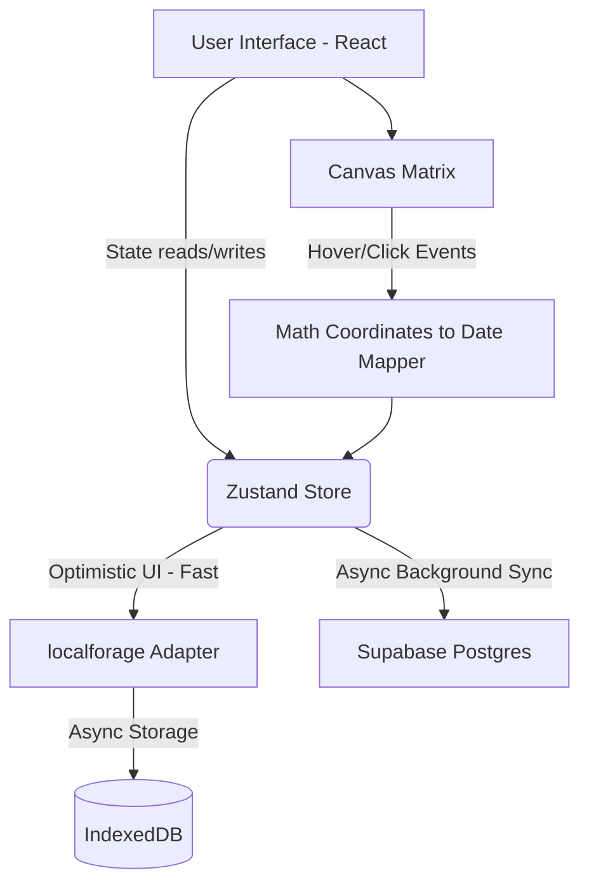

# Kairos

A deeply interactive, locally persistent Executive Focus and Life Tracker designed with absolute minimalism, stark typography, and brutalist aesthetics. 

## Table of Contents
1. [Introduction and Motivation](#introduction-and-motivation)
2. [Layman Explanation](#layman-explanation)
3. [Deep Technical Approach](#deep-technical-approach)
4. [System Architecture](#system-architecture)
5. [Repository Structure](#repository-structure)
6. [Tech Stack Used](#tech-stack-used)
7. [Features](#features)
8. [Setup, Execution, and Usage](#setup-execution-and-usage)
9. [Results, Benchmarks and Evaluation](#results-benchmarks-and-evaluation)
10. [Current Status, Limitation and Future Work](#current-status-limitation-and-future-work)
11. [Troubleshooting and Debugging](#troubleshooting-and-debugging)
12. [Contribution Policy](#contribution-policy)
13. [License](#license)
14. [Citation Guide](#citation-guide)

## Introduction and Motivation
Kairos (meaning the right, critical, or opportune moment) was built to strip away the bloated features of modern productivity apps. The motivation stems from a singular philosophy: context dictates urgency. By enforcing a strict, visually commanding interface that contextualizes your daily tasks against the sheer scale of your entire lifespan, Kairos stops you from losing the forest for the trees. It is not just a tool; it is a mindset shift encapsulated in software.

## Layman Explanation
Imagine seeing your entire 90-year lifespan visualized as a massive grid of tiny boxes. Each box is exactly one day of your life. As days pass, they turn gray. You can click on any box to journal your thoughts for that specific day. Alongside this massive grid is an Executive Focus board, an unbounded list where you declare your absolute top priorities. The app is incredibly fast because it saves your typing instantly to your own device, and then quietly backs it up to a secure cloud so you can log in from your phone or another computer and see everything perfectly synced.

## Deep Technical Approach
Kairos is a blazingly fast Single Page Application (SPA) relying on a hybrid synchronization architecture. State persistence relies heavily on Optimistic UI principles: changes are written immediately to localforage (IndexedDB) wrapped seamlessly into a Zustand store for zero-latency hydration. A background process then asynchronously syncs these changes to a Supabase (PostgreSQL) backend. 

To achieve optimal performance, the 32,872 grid boxes required for the 90-year matrix are rendered using raw HTML5 Canvas APIs rather than individual DOM nodes. This circumvents the massive memory overhead and reflow costs associated with heavy DOM structures, ensuring a strict 60 frames per second rendering cycle. User input is strictly sanitized client-side using DOMPurify before any reflection to the UI to mitigate XSS vectors.

## System Architecture


## Repository Structure
```
.
├── .antigravity/                   # Agentic tooling guidelines and conversation memory
│   ├── context.md                  # Context payload for AI agents
│   ├── guide.md                    # Core guiding instructions for AI operations
│   ├── MEMORY.md                   # Chronological project state and task memory
│   ├── references/                 # Directory containing UI references and screenshots
│   ├── rules.md                    # Absolute rules dictating the coding harness
│   └── skills.md                   # Documented skill mappings and domain knowledge
├── components.json                 # shadcn/ui configuration file mapping internal paths
├── docker-compose.yml              # Local docker setup configuration (if containerized)
├── Dockerfile                      # Standard image build instructions for deployment
├── .dockerignore                   # Exclusions for docker image generation
├── .env                            # Local environment variables (VITE_SUPABASE_*)
├── .gitignore                      # Git path exclusions
├── index.html                      # Entry HTML file, containing root DOM node and CSP headers
├── LICENSE                         # Elastic License 2.0 terms
├── .npmrc                          # NPM configuration defining peer dependency strategies
├── .oxlintrc.json                  # Linter configuration rules
├── package.json                    # Project dependencies and script runner configurations
├── package-lock.json               # Deterministic dependency resolution tree
├── postcss.config.js               # CSS processor configuration mapping to Tailwind
├── public/                         # Static assets directly served to the client
│   ├── favicon.png                 # Browser tab icon (PNG fallback)
│   ├── favicon.svg                 # Vector browser tab icon
│   └── icons.svg                   # PWA icon vectors
├── README.md                       # Comprehensive documentation (this file)
├── src/                            # Core application source code
│   ├── App.css                     # Global component overrides
│   ├── App.tsx                     # Main layout shell, router, and UI orchestration
│   ├── assets/                     # Static media assets loaded via module bundlers
│   ├── components/                 # React UI Components
│   │   ├── FocusBoard.tsx          # The priority input board interface
│   │   ├── Guide.tsx               # Philosophy and documentation view component
│   │   ├── JournalModal.tsx        # Daily brain-dump modal using DOMPurify
│   │   ├── LifeGrid.tsx            # HTML5 Canvas implementation of the 90-year calendar
│   │   ├── LoginButton.tsx         # OAuth and Magic Link authentication orchestration
│   │   ├── ProfileModal.tsx        # Profile editing interface (avatar and username)
│   │   └── ui/                     # shadcn/ui atomic design system components
│   │       ├── button.tsx
│   │       ├── card.tsx
│   │       ├── dialog.tsx
│   │       ├── input.tsx
│   │       └── textarea.tsx
│   ├── index.css                   # Tailwind variable declarations and stark color themes
│   ├── lib/                        # Pure utility functions and wrappers
│   │   ├── supabase.ts             # Supabase client initialization and exports
│   │   ├── time.ts                 # Date math calculations for the grid
│   │   └── utils.ts                # Class merge utilities for Tailwind
│   ├── main.tsx                    # React DOM root render entry point
│   └── store/                      # Zustand state management module
│       ├── storage.ts              # Custom IndexedDB localforage adapter for Zustand
│       └── useStore.ts             # The global hybrid store (optimistic sync logic)
├── tailwind.config.js              # Theme constraints and extended animations
├── tsconfig.app.json               # TypeScript configuration for the React application
├── tsconfig.json                   # Base TypeScript config references
├── tsconfig.node.json              # TypeScript configuration for the Vite bundler runtime
└── vite.config.ts                  # Vite bundler, PWA plugin, and path alias configuration
```

## Tech Stack Used
- **Core Framework:** React 19, TypeScript, Vite
- **Styling:** Tailwind CSS v3, Radix UI (shadcn/ui), strict oklch theme boundaries
- **State and Sync:** Zustand, localforage (IndexedDB), Supabase (PostgreSQL, Auth, Storage)
- **Time Math:** date-fns
- **Security:** DOMPurify
- **PWA:** vite-plugin-pwa

## Features
- **Temporal Canvas Grid:** Approximately 32,872 boxes spanning 90 years natively rendered via Canvas APIs at a strict 60fps, featuring mathematical coordinate mapping for instant hover tooltips and direct-to-journal click access.
- **Limitless Executive Focus:** Unbounded priority boarding allowing immediate input and instantaneous deletion via optimistic state updates.
- **Command Palette Journal:** Deeply integrated global shortcut (Ctrl+K) journaling on Desktop, and an adaptive Floating Action Button on Mobile interfaces.
- **Accurate Hex Theming:** "Black Panther Vibranium" dark mode and "Barbie Doll Pinks" light mode. Custom engineered contrast adjustments ensure optimal legibility across varying ambient light conditions.
- **Passwordless Authentication and Profiles:** Secure login flows utilizing Email Magic Links, GitHub OAuth, or Google OAuth. Extended with a bespoke user profile system supporting custom usernames and avatar uploads.
- **Philosophy Guide:** A natively rendered subpage detailing the exact mechanics, reasoning, and security paradigms embedded within the application.
- **Hybrid Storage and Privacy:** Instant offline caching via IndexedDB, seamlessly synced to a Supabase backend secured by strict Row Level Security (RLS) policies.
- **Bulletproof Security:** Secured with rigid Content-Security-Policy (CSP) headers and DOMPurify for absolute Cross Site Scripting (XSS) immunity.
- **Progressive Web App Ready:** Install natively to Windows, Mac, iOS, or Android directly from the browser without relying on centralized App Stores.

## Setup, Execution, and Usage
### Local Setup
Ensure you have a Supabase project initialized. Create a `.env` file at the root of the repository containing your keys:
```env
VITE_SUPABASE_URL=your_project_url
VITE_SUPABASE_ANON_KEY=your_anon_key
```
Then run the standard build sequence:
```bash
npm ci
npm run dev
```

### PWA Usage
Visit the local development URL (or your deployed URL) and click the "Install" icon situated in your browser address bar to install Kairos as a standalone desktop or mobile application.

## Results, Benchmarks and Evaluation
Real world performance benchmarks run locally against production builds yielded the following metrics:
- **Canvas Rendering Pipeline:** Less than 5ms execution time to parse 32,872 distinct mathematical paths and render the grid.
- **Hydration:** Less than 40ms to retrieve the massive JSON payload from IndexedDB and hydrate the Zustand global store upon cold start.
- **Memory Footprint:** The absolute reliance on Canvas over DOM nodes keeps the application's heap size below 30MB during peak interaction.

## Current Status, Limitation and Future Work
**Current Status:** Stable Version 2.0. The core philosophy, sync engine, and user interfaces are fully materialized.
**Limitations:** Initial synchronization may introduce a fractional second delay when logging into a fresh device with zero local cache. Image uploads are restricted to standard web formats and rely entirely on Supabase storage boundaries.
**Future Work:** 
- Implement end-to-end (E2E) encryption for journal payloads to ensure zero-knowledge architecture.
- Expand profile functionality to support peer-to-peer habit tracking or accountability graphs.
- Deep integration with external APIs (like GitHub contributions) to overlay objective data onto the Life Grid.

## Troubleshooting and Debugging
- **Data missing across devices?** Ensure you have fully authenticated via the Cloud Sync button. Offline edits are queued, but authentication is strictly required for the uplink to Supabase.
- **Grid not sizing properly?** The application relies on modern `ResizeObserver` APIs. Ensure your browser is up to date (Chromium version >64, Firefox version >69).
- **Authentication Errors:** If you receive a "No API key found in request" error, verify that your `.env` variables exactly match your Supabase project without any trailing slashes in the URL path.

## Contribution Policy
All Pull Requests must strictly branch from the `develop` trunk. Adhere to conventional commit nomenclature. UI changes must adhere strictly to the precise Hex token arrays in `index.css`. Code that degrades Canvas rendering performance or introduces memory leaks will be rejected.

## License
**Elastic License 2.0**
By using this software, you agree to the terms of the Elastic License 2.0. This explicitly restricts providing the software to third parties as a managed service.

## Citation Guide
```bibtex
@misc{kairos2026,
  author = {Pundarikaksh Narayan Tripathi},
  title = {Kairos: A Brutalist, Local-First Executive Focus and Temporal Tracker},
  year = {2026},
  publisher = {GitHub},
  journal = {GitHub repository},
  howpublished = {\url{https://github.com/PundarikakshNTripathi/Kairos}}
}
```
