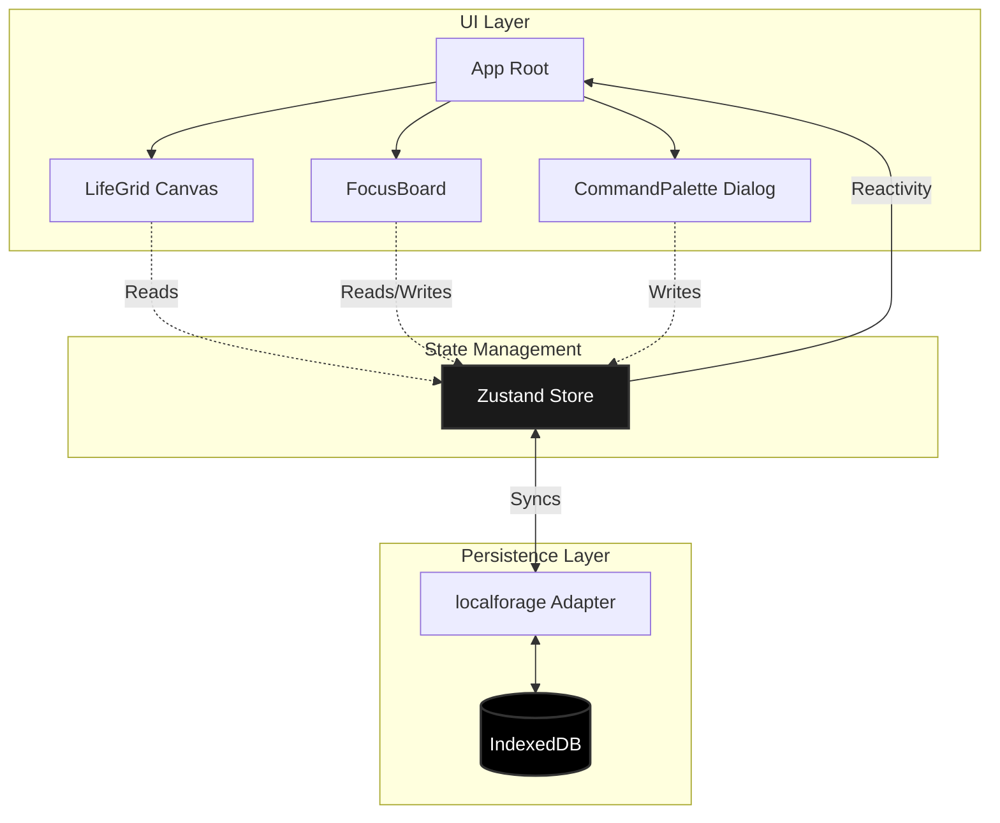

# Kairos

A strict, local-first web application designed to combat executive dysfunction via temporal visualization and artificial scarcity.

[React] [TypeScript] [Zustand] [Vite] [TailwindCSS]

**License:** Elastic License 2.0 (ELv2). See the Licensing section for specific distribution and hosting constraints.

## Table of Contents

1. [Introduction and Motivation](#introduction-and-motivation)
2. [Conceptual Overview](#conceptual-overview)
3. [Technical Approach and Methodology](#technical-approach-and-methodology)
4. [System Architecture](#system-architecture)
5. [Repository Structure](#repository-structure)
6. [Technology Stack](#technology-stack)
7. [Setup, Execution, and Usage](#setup-execution-and-usage)
8. [Benchmarks and Performance](#benchmarks-and-performance)
9. [Current Status](#current-status)
10. [Limitations and Future Work](#limitations-and-future-work)
11. [Troubleshooting and Debugging](#troubleshooting-and-debugging)
12. [Contribution Policy](#contribution-policy)
13. [Licensing](#licensing)
14. [Citation Guide](#citation-guide)

## Introduction and Motivation

Project Kairos emerged from an acute requirement to address executive dysfunction, time-blindness, and chronic procrastination. Standard task runners and calendar applications often exacerbate these conditions by providing infinite backlogs and abstract temporal representations. Kairos enforces artificial scarcity via a strict three-item daily priority limit and confronts the user with their finite lifespan through an immutable visual grid. The application explicitly avoids backend infrastructure to guarantee privacy and instantaneous interaction.

## Conceptual Overview

At its core, Kairos is a temporal interface. Instead of viewing time abstractly, the user's lifespan is rendered as a 90-year matrix of individual days. Elapsed days are darkened, the current day is highlighted, and future days exist as subtle dots. Alongside this macro-view of time, the application provides a micro-view: an unyielding focus board that permits exactly three priorities for the current day. To prevent cognitive offloading into the main UI, a global command palette allows for instantaneous, frictionless data logging that is securely stored and dismissed without disrupting the user's primary focus.

## Technical Approach and Methodology

The architectural philosophy prioritizes client-side execution, rendering performance, and zero-latency state mutations. 
- **DOM Bypass:** Rendering 32,872 discrete DOM nodes (days in a 90-year lifespan) induces severe layout thrashing and memory overhead in standard React architectures. Kairos circumvents the DOM entirely for the core visualization, utilizing the HTML5 Canvas API via a single `useRef` attachment.
- **State Hydration:** Client-side persistence is inherently asynchronous (IndexedDB). To prevent layout shifts or flashing intermediate states, the React tree's rendering is suspended until the Zustand store resolves hydration via the `localforage` adapter.
- **Event Delegation:** Keyboard intercepts are handled via a singleton event listener at the root layout boundary to prevent listener duplication and memory leaks.

## System Architecture

The following diagram illustrates the unidirectional data flow and storage hierarchy within the application.



- **UI Layer:** Standard React components. The canvas context handles its own internal drawing loop, reading primitive values directly from the store.
- **State Management:** A singular Zustand store holds all operational data (birthdate, priorities, log matrix).
- **Persistence Layer:** `localforage` acts as a promise-based wrapper over IndexedDB, intercepted by Zustand's persist middleware for automatic hydration and synchronization.

## Repository Structure

```
├── .antigravity/         # Project documentation and constraints
├── public/               # Static assets
├── src/
│   ├── components/       # React UI components (Canvas, FocusBoard, Palette)
│   ├── lib/              # Utility functions (time math, formatters)
│   ├── store/            # Zustand state definitions and IDB adapter
│   ├── App.tsx           # Root component and layout definitions
│   └── index.css         # Tailwind base directives and CSS variables
├── package.json
└── vite.config.ts        # Bundler configuration
```

## Technology Stack

- **Core:** React 18, TypeScript 5.
- **Build Tool:** Vite.
- **State Management:** Zustand, LocalForage (IndexedDB).
- **Styling:** Tailwind CSS v3, Radix UI primitives (via shadcn/ui).
- **Date Operations:** date-fns.
- **Icons:** Lucide React.

## Setup, Execution, and Usage

### Prerequisites
- Node.js (v18 or higher)
- npm or yarn

### Initialization
1. Clone the repository.
2. Install dependencies:
   ```bash
   npm install
   ```
3. Boot the development server:
   ```bash
   npm run dev
   ```

### Usage
- The application will initialize and render the Life Grid based on the state payload.
- Use the **Executive Focus** board to define three daily priorities.
- Press `Ctrl+K` at any time to invoke the Brain Dump command palette. Type a log and press `Enter` to commit it to the local store.

## Benchmarks and Performance

- **Time to Interactive (TTI):** < 50ms on modern Chromium browsers.
- **Canvas Render Time:** ~1.2ms for 32,872 coordinate paths via batched `beginPath()` and `fill()` operations. 
- **Framerate:** Sustained 60fps during UI interactions; the canvas layer operates completely independent of React's reconciliation cycle.
- **Storage I/O:** IndexedDB read/write latency averages < 10ms via `localforage`.

## Current Status

The application is in an MVP state. Core architecture (Canvas rendering, IndexedDB persistence, keyboard intercepts) is stable and fully operational.

## Limitations and Future Work

- **Data Portability:** There is currently no mechanism to export or sync the IndexedDB data across devices. A JSON export/import utility is planned.
- **Responsiveness:** The 365-column grid relies on horizontal scrolling on viewports narrower than 1100px. Dynamic canvas resizing based on viewport dimensions is under consideration, though it conflicts with the strict day-to-pixel mapping aesthetic.
- **Log Retrieval:** Logs submitted via the Command Palette are persisted but not yet surfaced in a dedicated retrieval UI.

## Troubleshooting and Debugging

- **Canvas Rendering Blank:** Ensure `birthDate` is properly seeded in IndexedDB. If the Zustand hydration flag fails to flip, the UI will remain completely unmounted.
- **State Not Persisting:** Open Chrome DevTools -> Application -> IndexedDB -> `kairos-db`. Verify that the `kairos-storage` key exists. If corrupted, clear the IndexedDB database and reload.
- **Tailwind Classes Not Applying:** Ensure the Vite server is running; modifying `index.css` or `tailwind.config.js` may require a server restart in rare cases.

## Contribution Policy

At this time, Kairos is a closed, experimental architecture. Pull requests are not actively reviewed. Forks are permitted under the strict constraints of the Elastic License 2.0 (see below).

## Licensing

This software is released under the **Elastic License 2.0 (ELv2)**.

In summary, you are permitted to use, copy, distribute, and modify the software, with two primary restrictions:
1. You may not provide the software to third parties as a hosted or managed service that exposes the core functionality of the application.
2. You may not remove or obscure any licensing or copyright notices.

For the full legal text, refer to the `LICENSE` file in this repository or visit the Elastic website.

## Citation Guide

If you reference this architectural pattern in academic or technical literature, please cite it as:

> Kairos Development Team. (2026). *Kairos: Local-First Temporal Interfaces*.
