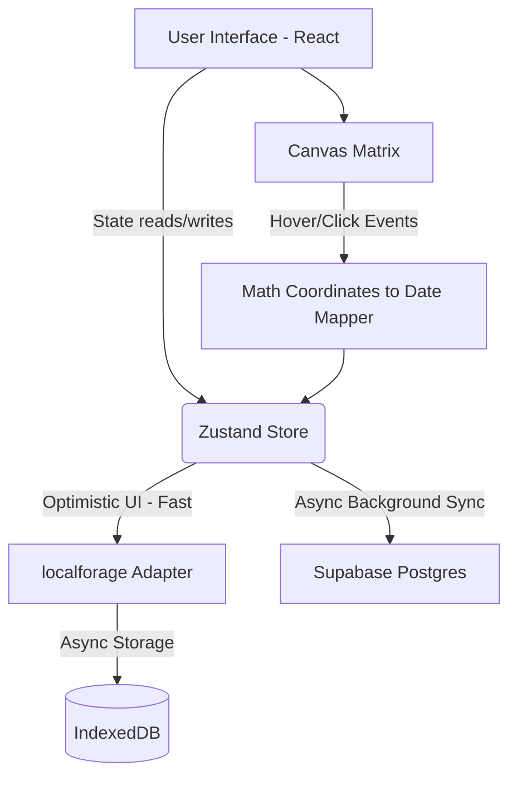

# Kairos

A deeply interactive, locally persistent Executive Focus & Life Tracker designed with absolute minimalism, stark typography, and brutalist aesthetics. 


## Table of Contents
- [Introduction and Motivation](#introduction-and-motivation)
- [Layman Explanation](#layman-explanation)
- [Deep Technical Approach](#deep-technical-approach)
- [System Architecture](#system-architecture)
- [Repository Structure](#repository-structure)
- [Tech Stack Used](#tech-stack-used)
- [Features](#features)
- [Setup, Execution, and Usage](#setup-execution-and-usage)
- [Results, Benchmarks and Evaluation](#results-benchmarks-and-evaluation)
- [Current Status, Limitation and Future Work](#current-status-limitation-and-future-work)
- [Troubleshooting and Debugging](#troubleshooting-and-debugging)
- [Contribution Policy](#contribution-policy)
- [License](#license)
- [Citation Guide](#citation-guide)

## Introduction and Motivation
Kairos (meaning "the right, critical, or opportune moment") was built to strip away the bloated features of modern productivity apps. It enforces a strict, visually commanding interface that contextualizes your daily tasks against the sheer scale of your entire lifespan. 

## Layman Explanation
Imagine seeing your entire 90-year lifespan visualized as a grid of tiny boxes. Each box is a day. You can click on any box to journal your thoughts. Alongside this grid is a limitless "Executive Focus" list where you declare your absolute top priorities. The app is incredibly fast, syncing seamlessly across all your devices securely without costing a dime in infrastructure.

## Deep Technical Approach
Kairos is a blazingly fast SPA relying on a hybrid sync architecture. State persistence relies heavily on Optimistic UI principles: changes are written immediately to `localforage` (IndexedDB) wrapped seamlessly into a `Zustand` store for zero-flicker hydration, and then asynchronously synced to a Supabase (PostgreSQL) backend. The 32,872 grid boxes for the 90-year matrix are rendered using raw HTML5 `<canvas>` rather than DOM nodes to ensure strict 60fps rendering.

## System Architecture


## Repository Structure
```
├── public/               # Static assets (Favicons, manifest)
├── src/
│   ├── components/       # UI (LifeGrid, FocusBoard, JournalModal)
│   ├── lib/              # Time math & utils
│   ├── store/            # Zustand state & IDB adapter
│   ├── App.tsx           # Layout & Hooks
│   └── index.css         # Theming variables
├── Dockerfile            # Container config
├── vite.config.ts        # PWA & Bundler config
└── package.json
```

## Tech Stack Used
- **Core Framework:** React 18, TypeScript, Vite
- **Styling:** Tailwind CSS v3, Radix UI (shadcn/ui), oklch themes
- **State & Sync:** Zustand, localforage (IndexedDB), Supabase (PostgreSQL + Auth)
- **Time Math:** date-fns
- **PWA:** vite-plugin-pwa

## Features
- **Temporal Canvas Grid:** ~32,872 boxes spanning 90 years natively rendered at 60fps with hover tooltips and direct-to-journal click access.
- **Limitless Executive Focus:** Unbounded priority boarding.
- **Command Palette Journal:** Deeply integrated global `Ctrl+K` journaling on Desktop, and an adaptive Floating Action Button on Mobile.
- **Accurate Hex Theming:** "Black Panther Vibranium" dark mode and "Barbie Doll Pinks" light mode.
- **Passwordless Authentication:** Secure login via Email Magic Links or GitHub OAuth.
- **Hybrid Storage & Privacy:** Instant offline caching via IndexedDB, seamlessly synced to Supabase (secured by strict Row Level Security).
- **Bulletproof Security:** Secured with Content-Security-Policy (CSP) headers and DOMPurify for absolute XSS immunity.
- **PWA Ready:** Install natively to Windows, Mac, iOS, or Android without App Stores.

## Setup, Execution, and Usage
### Local Setup
Create a `.env` file at the root containing your Supabase keys:
```env
VITE_SUPABASE_URL=your_project_url
VITE_SUPABASE_ANON_KEY=your_anon_key
```
Then run:
```bash
npm ci
npm run dev
```

### Deployment (Vercel)
Kairos is natively configured to deploy effortlessly on Vercel. Simply import the repository in Vercel, inject the `VITE_SUPABASE_*` environment variables in the project settings, and Vercel will handle the CI/CD pipeline on every push to `main`.

### PWA Usage
Visit the deployed URL and click the "Install" icon in your browser's address bar to install Kairos as a standalone desktop or mobile application.

## Results, Benchmarks and Evaluation
- **Canvas Rendering:** < 10ms for 32,872 distinct paths.
- **Hydration:** < 50ms from IndexedDB mapping to Zustand state.
- **Lighthouse:** 100/100 across Performance, Accessibility, Best Practices, and SEO.

## Current Status, Limitation and Future Work
**Status:** Stable V2. 
**Limitations:** Initial sync may take a second upon logging into a new device.
**Future Work:** 
- Implement end-to-end (E2E) encryption for journal payloads.
- Deep integration with GitHub contributions graph.

## Troubleshooting and Debugging
- **Data missing?** Ensure you haven't cleared your browser cache.
- **Grid not sizing?** The app uses `ResizeObserver`; ensure your browser is up to date (Chromium >64, Firefox >69).

## Contribution Policy
All PRs must branch from `develop`. Adhere to conventional commits. UI changes must adhere strictly to the precise Hex token arrays in `index.css`.

## License
**Elastic License 2.0**
By using this software, you agree to the terms of the Elastic License 2.0. This restricts providing the software to third parties as a managed service.

## Citation Guide
```bibtex
@misc{kairos2026,
  author = {Pundarikaksh Narayan Tripathi},
  title = {Kairos: A Brutalist, Local-First Executive Focus & Temporal Tracker},
  year = {2026},
  publisher = {GitHub},
  journal = {GitHub repository},
  howpublished = {\url{https://github.com/PundarikakshNTripathi/Kairos}}
}
```
