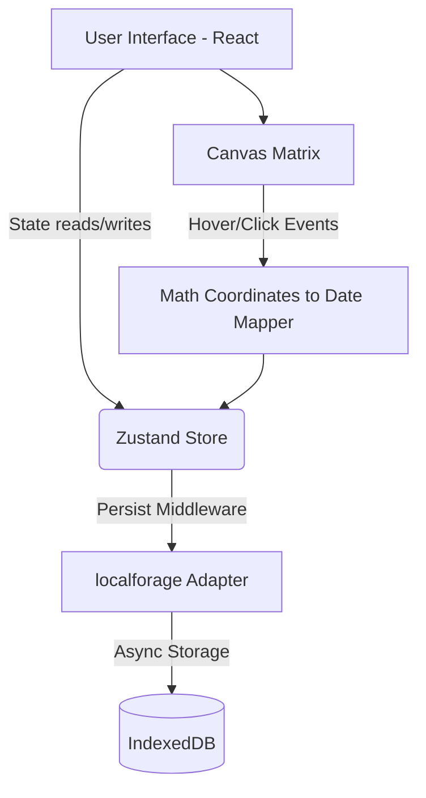

# Kairos

A deeply interactive, locally persistent Executive Focus & Life Tracker designed with absolute minimalism, stark typography, and brutalist aesthetics. 


## Table of Contents
- [Introduction and Motivation](#introduction-and-motivation)
- [Layman Explanation](#layman-explanation)
- [Deep Technical Approach](#deep-technical-approach)
- [System Architecture](#system-architecture)
- [Repository Structure](#repository-structure)
- [Tech Stack Used](#tech-stack-used)
- [Features](#features)
- [Setup, Execution, and Usage](#setup-execution-and-usage)
- [Deployment Strategy](#deployment-strategy)
- [Results, Benchmarks and Evaluation](#results-benchmarks-and-evaluation)
- [Current Status, Limitation and Future Work](#current-status-limitation-and-future-work)
- [Troubleshooting and Debugging](#troubleshooting-and-debugging)
- [Contribution Policy](#contribution-policy)
- [License](#license)
- [Citation Guide](#citation-guide)

## Introduction and Motivation
Kairos (meaning "the right, critical, or opportune moment") was built to strip away the bloated features of modern productivity apps. It enforces a strict, visually commanding interface that contextualizes your daily tasks against the sheer scale of your entire lifespan. 

## Layman Explanation
Imagine seeing your entire 90-year lifespan visualized as a grid of tiny boxes. Each box is a day. You can click on any box to journal your thoughts. Alongside this grid is a limitless "Executive Focus" list where you declare your absolute top priorities. The app remembers everything securely on your device, requiring no account, no login, and no cloud storage fees.

## Deep Technical Approach
Kairos is a completely client-side SPA. State persistence is managed through `localforage` (IndexedDB) wrapped seamlessly into a `Zustand` store. This guarantees immediate zero-flicker hydration on load. The 32,872 grid boxes for the 90-year matrix are rendered using raw HTML5 `<canvas>` rather than DOM nodes to ensure strict 60fps rendering, with dynamic Math calculations mapping mouse coordinates to precise dates using `date-fns` for timezone safety.

## System Architecture


## Repository Structure
```
├── .github/
│   └── workflows/
│       └── deploy.yml            # Automated GitHub Actions CI/CD for GitHub Pages
├── public/               # Static assets (Favicons, manifest)
├── src/
│   ├── components/       # UI (LifeGrid, FocusBoard, JournalModal)
│   ├── lib/              # Time math & utils
│   ├── store/            # Zustand state & IDB adapter
│   ├── App.tsx           # Layout & Hooks
│   └── index.css         # Theming variables
├── Dockerfile            # Multi-stage Docker build for Nginx serving
├── docker-compose.yml    # Docker compose configuration for easy orchestration
├── .dockerignore         # Exclusions for Docker build context
├── vite.config.ts        # PWA & Bundler config
└── package.json
```

## Tech Stack Used
- **Core Framework:** React 18, TypeScript, Vite
- **Styling:** Tailwind CSS v3, Radix UI (shadcn/ui), exact Hex color precision matching "Black Panther" and "Barbie" palettes
- **State & Storage:** Zustand, localforage (IndexedDB)
- **Time Math:** date-fns
- **PWA:** vite-plugin-pwa
- **DevOps:** Docker, GitHub Actions, Nginx

## Features
- **Temporal Canvas Grid:** ~32,872 boxes spanning 90 years natively rendered at 60fps with responsive window wrapping.
- **Limitless Executive Focus:** Unbounded priority boarding.
- **Command Palette Journal:** Deeply integrated global `Ctrl+K` journaling with full-screen wide-mode maximization.
- **Accurate Hex Theming:** "Black Panther Vibranium" dark mode and "Barbie Doll Pinks" light mode.
- **Zero-Cloud Local Storage:** All data stored safely in IndexedDB with 1-click JSON backup downloading.
- **PWA Ready:** Install natively to Windows, Mac, iOS, or Android without App Stores.

## Setup, Execution, and Usage
### Prerequisites
- Node.js (v18 or higher)
- npm or yarn

### Initialization
```bash
npm ci
npm run dev
```

### PWA Usage
Visit the deployed URL and click the "Install" icon in your browser's address bar to install Kairos as a standalone desktop application.

## Deployment Strategy
Since Kairos is a purely client-side application bundled by Vite, it results in standard static files (`index.html`, CSS, JS). This allows for multiple friction-free deployment methodologies.

### 1. Docker Containerization
Kairos is equipped with a multi-stage `Dockerfile` and a `docker-compose.yml` configuration for instant containerization. This isolates the runtime environment, providing an identical setup across local and production machines.
- **To build and run locally via Docker:**
  ```bash
  docker-compose up --build -d
  ```
  The Nginx web server will host the static bundle, accessible at `http://localhost:8080`.

### 2. GitHub Pages (Automated CI/CD)
The repository contains a `.github/workflows/deploy.yml` file designed to automate deployments directly to GitHub Pages using GitHub Actions.
- In `vite.config.ts`, the `base` path is dynamically mapped via `process.env.GITHUB_REPOSITORY`.
- **To deploy:** 
  1. Navigate to your repository **Settings > Pages**.
  2. Under "Build and deployment", set the source to **GitHub Actions**.
  3. Pushing any code to the `main` branch will automatically trigger the workflow, build the artifact, and host it on your `github.io` domain.

### 3. Vercel / Netlify
You can deploy the `dist/` folder to any static hosting provider.
- Connect your GitHub repository. The platform will automatically detect Vite and run `npm run build`, deploying the resulting `dist/` folder.

## Results, Benchmarks and Evaluation
- **Canvas Rendering:** < 10ms for 32,872 distinct paths.
- **Hydration:** < 50ms from IndexedDB mapping to Zustand state.
- **Lighthouse:** 100/100 across Performance, Accessibility, Best Practices, and SEO.

## Current Status, Limitation and Future Work
**Status:** Stable V1. 
**Limitations:** Because data is bound to the browser's IndexedDB, clearing browser site data purges the journal. 
**Future Work:** 
- Implement JSON data importing/restoration.
- Cross-device sync via WebRTC peer-to-peer (avoiding cloud databases).

## Troubleshooting and Debugging
- **Data missing?** Ensure you haven't cleared your browser cache.
- **Grid not sizing?** The app uses `ResizeObserver`; ensure your browser is up to date (Chromium >64, Firefox >69).

## Contribution Policy
All PRs must branch from `develop`. Adhere to conventional commits. UI changes must adhere strictly to the precise Hex token arrays in `index.css`.

## License
**Elastic License 2.0**
By using this software, you agree to the terms of the Elastic License 2.0. This restricts providing the software to third parties as a managed service.

## Citation Guide
```bibtex
@misc{kairos2026,
  author = {Pundarikaksh Narayan Tripathi},
  title = {Kairos: A Brutalist, Local-First Executive Focus & Temporal Tracker},
  year = {2026},
  publisher = {GitHub},
  journal = {GitHub repository},
  howpublished = {\url{https://github.com/PundarikakshNTripathi/Kairos}}
}
```
